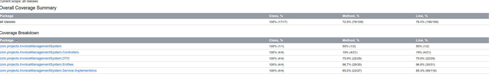

# Invoice Management System 

## Problem Statement

The goal is to design and implement a database schema for an invoice management system. The system should be able to handle multiple users who can create invoices. Each invoice can have multiple items and can have multiple history entries for tracking changes and events. The following are the main entities involved in the system:

## Assumptions

1. **User Detail**:
   - Each user is uniquely identified by a UUID (`user_id`).
   - Users have a username, creation timestamp, and status.
   - Here I am Assuming User entity exists:

2. **Invoice**:
   - Each invoice is uniquely identified by a UUID (`invoice_id`).
   - Each invoice is created by a user, referenced by the `created_by` foreign key.
   - Invoices have a unique invoice number, PAN number, GST number, and a creation timestamp.

3. **Invoice Item**:
   - Each invoice item is uniquely identified by a UUID (`invoice_item_id`).
   - Each item is associated with an invoice, referenced by the `invoice_id` foreign key.
   - Items have a name, description, and a creation timestamp.
   - Each item tracks the user who created it, referenced by the `created_by` foreign key.

4. **Invoice History**:
   - Each history entry is uniquely identified by a UUID (`invoice_history_id`).
   - Each history entry is associated with an invoice, referenced by the `invoice_id` foreign key.
   - History entries track events related to the invoice and have a creation timestamp.
   - Each history entry tracks the user who created it, referenced by the `created_by` foreign key.

## Database Relationships

### `user_detail` and `invoice`
- **Relationship Type**: One-to-Many
- **Details**: One `user_detail` can create multiple `invoices`.
- **Foreign Key**: `invoice.created_by` references `user_detail.user_id`

### `invoice` and `invoice_item`
- **Relationship Type**: One-to-Many
- **Details**: One `invoice` can have multiple `invoice_items`.
- **Foreign Key**: `invoice_item.invoice_id` references `invoice.invoice_id`

### `invoice` and `invoice_history`
- **Relationship Type**: One-to-Many
- **Details**: One `invoice` can have multiple `invoice_histories`.
- **Foreign Key**: `invoice_history.invoice_id` references `invoice.invoice_id`

### `user_detail` and `invoice_history`
- **Relationship Type**: One-to-Many
- **Details**: One `user_detail` can create multiple `invoice_histories`.
- **Foreign Key**: `invoice_history.created_by` references `user_detail.user_id`

## ER Diagram

## Test coverage Result
The following is the test coverage report for the InvoiceManagementSystem project, detailing the coverage percentages for each package and class within the project.
### Overall Coverage
- **Class Coverage:** 100% (17/17)
- **Method Coverage:** 72.5% (79/109)
- **Line Coverage:** 78.4% (156/199)
  #### Report
  
